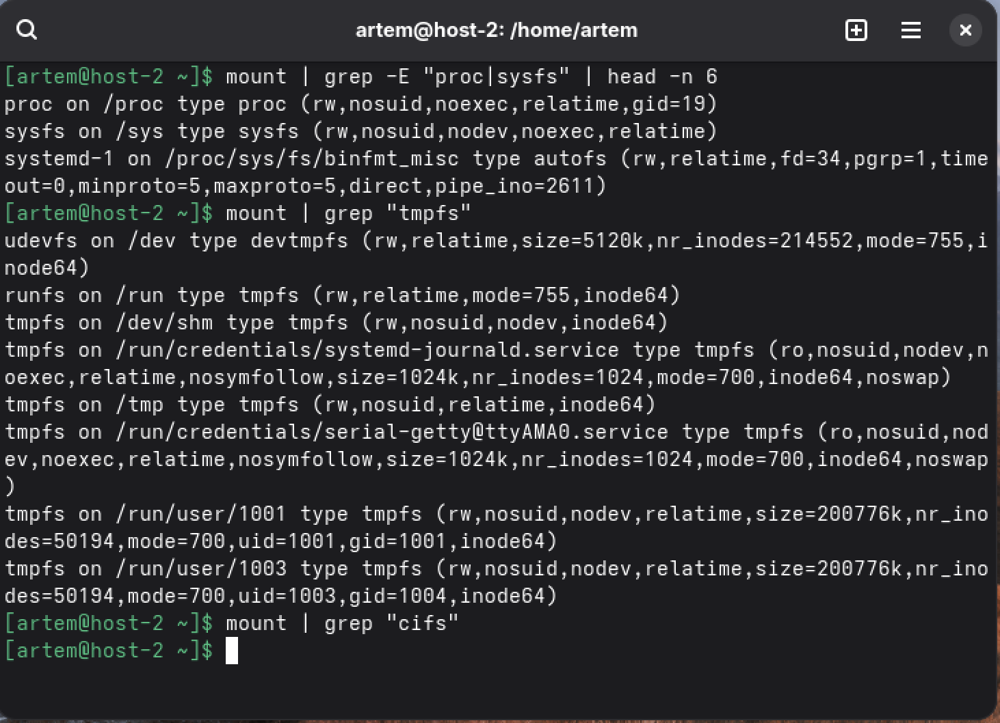
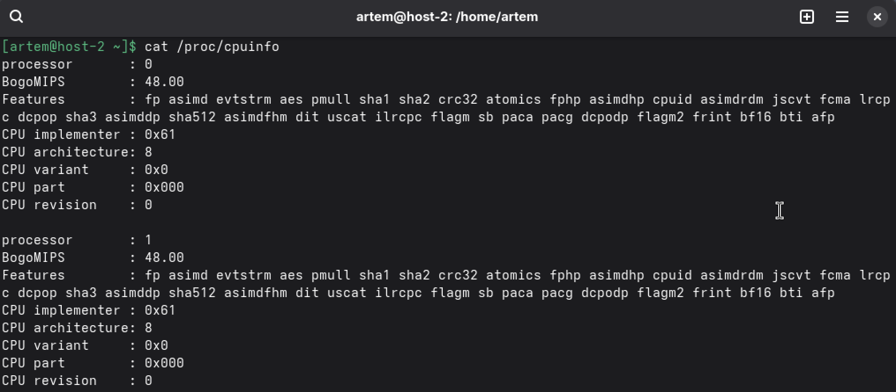
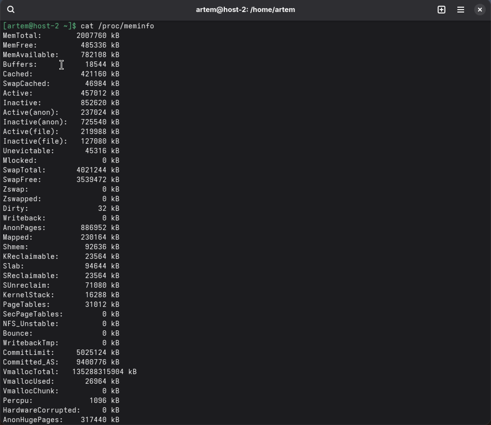
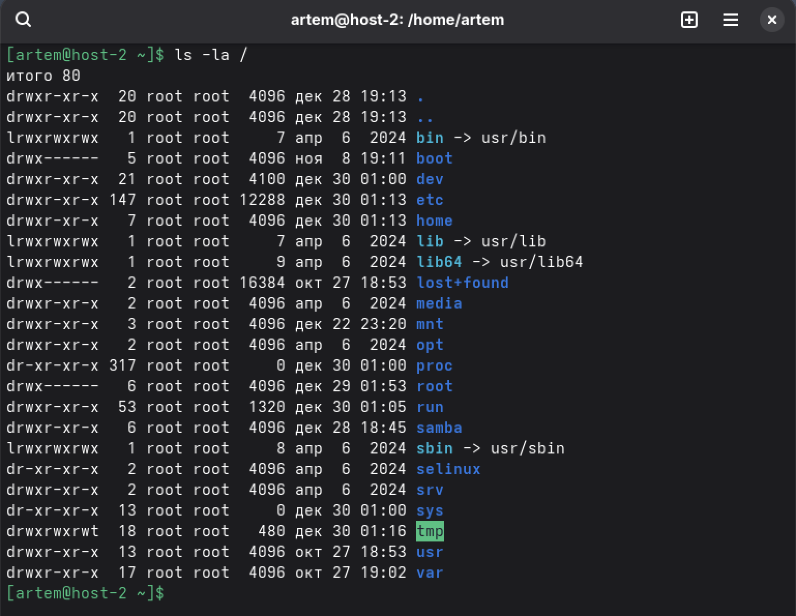
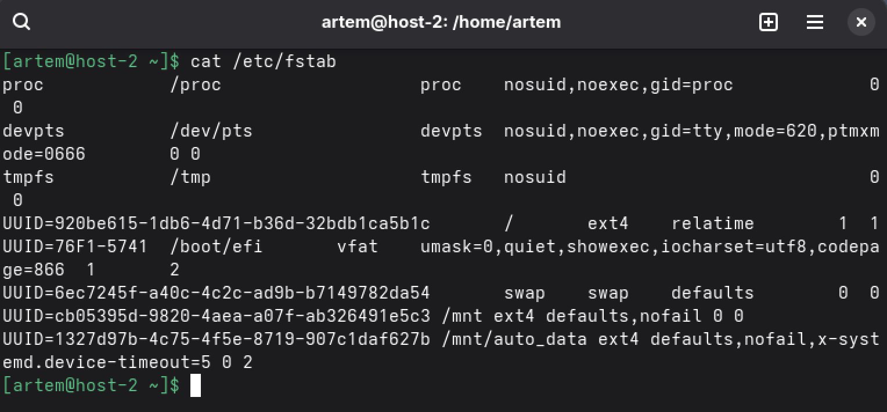
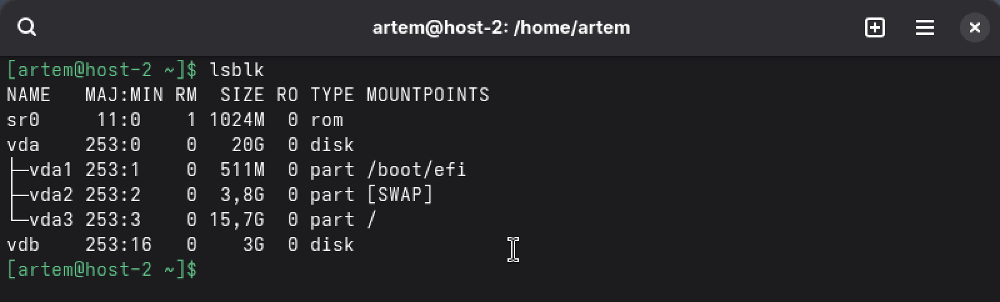

task1 - ФС
1. Известные файловые системы:

Windows: FAT32, exFAT, NTFS

Linux: ext2/3/4, XFS, Btrfs, ZFS

Сетевые: NFS, CIFS/SMB

Специальные: procfs, sysfs, tmpfs, devfs

macOS: HFS+, APFS

2. Классификация и отличия:

По назначению: дисковые (ext4), сетевые (NFS), виртуальные (proc)

По структуре: журналируемые (ext4) vs нежурналируемые (FAT32)

По поддержке прав: UNIX-права (ext4) vs Windows-права (NTFS)

3. Основные в Linux: ext4 (стандарт), XFS (для больших файлов), Btrfs (снапшоты), tmpfs (в RAM)

4. Создание ФС на диске:

sudo mkfs.ext4 /dev/sdX1

sudo mkfs.xfs /dev/sdX2

5. Монтирование - подключение ФС к дереву каталогов:

sudo mount /dev/sdX1 /mnt/mydisk

Автомонтирование: /etc/fstab

6. Специальные ФС и их каталоги:

procfs (/proc) - информация о процессах и системе

sysfs (/sys) - данные о устройствах и драйверах ядра

tmpfs (/tmp, /dev/shm) - временные файлы в RAM

cifs (любой каталог) - сетевые шары Windows/SMB

Чтобы вывести точки монтирования, воспользуемся командой mount с фильтрацией grep.

7. Информация о системе через cat:

cat /proc/cpuinfo      # Информация о процессоре

cat /proc/meminfo      # Состояние памяти

cat /proc/loadavg      # Нагрузка системы

cat /proc/version      # Версия ядра

task2 - Структура каталогов
1. Структура каталогов:

/       - корень

bin     - основные бинарные файлы (команды)

sbin    - системные бинарные файлы (админские)

etc     - конфигурационные файлы

home    - домашние папки пользователей

root    - домашняя папка суперпользователя

usr     - пользовательские программы

var     - изменяемые данные (логи, кэш)

tmp     - временные файлы

proc    - виртуальная ФС процессов

dev     - файлы устройств

Список файлов в корне:

ls -la /

2. Папки пользователей хранятся в /home/

/home/user1, /home/user2

3. Домашняя папка root: /root/

4. Основные конфиги в /etc/:

/etc/passwd - пользователи

/etc/group - группы

/etc/fstab - монтирование дисков

/etc/ssh/sshd_config - настройки SSH

5. Назначение папок:

/bin - основные команды для всех (ls, cp, cat)

/sbin - системные команды для админа (fdisk, ifconfig)

/usr/bin - пользовательские программы

/usr/sbin - дополнительные системные утилиты

Разница: /bin и /sbin нужны для загрузки системы, /usr/... - для работы после загрузки

task3 - Продолжаем
1. fstab:

cat /etc/fstab

2. Добавить диск в ВМ:

Добавить новый виртуальный диск

Перезапустить ВМ или просканировать шину:

sudo echo "- - -" > /sys/class/scsi_host/host0/scan

3. Информация о блочных устройствах:

lsblk

Или: sudo fdisk -l

Новый диск будет виден как /dev/sdb или /dev/vdb

4. Создать таблицу разделов и ФС ext4:

sudo fdisk /dev/sdb

# В fdisk: n (новый раздел), p (primary), Enter (всё пространство), w (сохранить)

sudo mkfs.ext4 /dev/sdb1

5. Монтирование диска:

sudo mkdir /mnt/mydisk

sudo mount /dev/sdb1 /mnt/mydisk

6. Создание файлов:

cd /mnt/mydisk

sudo touch testfile.txt

7. Отмонтировать и проверить:

cd /
sudo umount /mnt/mydisk
ls /mnt/mydisk  # Папка будет пустой (файлы остались на диске)

8. Автомонтирование через fstab:

# Узнаем UUID диска:

sudo blkid /dev/sdb1

# Редактируем fstab:

sudo nano /etc/fstab

# Добавляем строку:

UUID=uuid диска /mnt/mydisk ext4 defaults 0 2

9. Проверка fstab перед перезагрузкой:

sudo mount -a  # Монтирует всё из fstab

10. Перезагрузка и проверка:

sudo reboot

mount | grep /mnt/mydisk  # Должен быть примонтирован

task4 - Продолжаем
1. RAID — избыточный массив независимых дисков. Типы:

RAID 0 (stripe) — чередование

RAID 1 (mirror) — зеркалирование

RAID 5 — чередование + чётность,

RAID 10 — зеркало+чередование

2. Добавить 2 диска в ВМ и отформатировать:

sudo fdisk /dev/sdb  # Создать раздел

sudo fdisk /dev/sdc

sudo mkfs.ext4 /dev/sdb1

sudo mkfs.ext4 /dev/sdc1

3. Создать RAID 0:

sudo mdadm --create /dev/md0 --level=0 --raid-devices=2 /dev/sdb1 /dev/sdc1

sudo mkfs.ext4 /dev/md0

sudo mount /dev/md0 /mnt

4. Проверка:

cat /proc/mdstat           # Статус RAID

mdadm --detail /dev/md0    # Детали

5. Удалить RAID 0, создать RAID 1:

sudo umount /mnt

sudo mdadm --stop /dev/md0

sudo mdadm --create /dev/md1 --level=1 --raid-devices=2 /dev/sdb1 /dev/sdc1

sudo mkfs.ext4 /dev/md1

6. Разница RAID 0 vs RAID 1:

RAID 0: скорость 2x, объём 2x, если 1 диск умер — все данные потеряны

RAID 1: скорость чтения высокая, запись = 1 диск, объём = 1 диск, переживает смерть 1 диска

7. ФС с встроенным RAID:

Btrfs (RAID 0,1,10,5,6 без mdadm)

ZFS (аналогично)

8. RAID при установке системы:

Да, в установщике (Ubuntu/CentOS) есть раздел "Конфигурация RAID/LVM"
