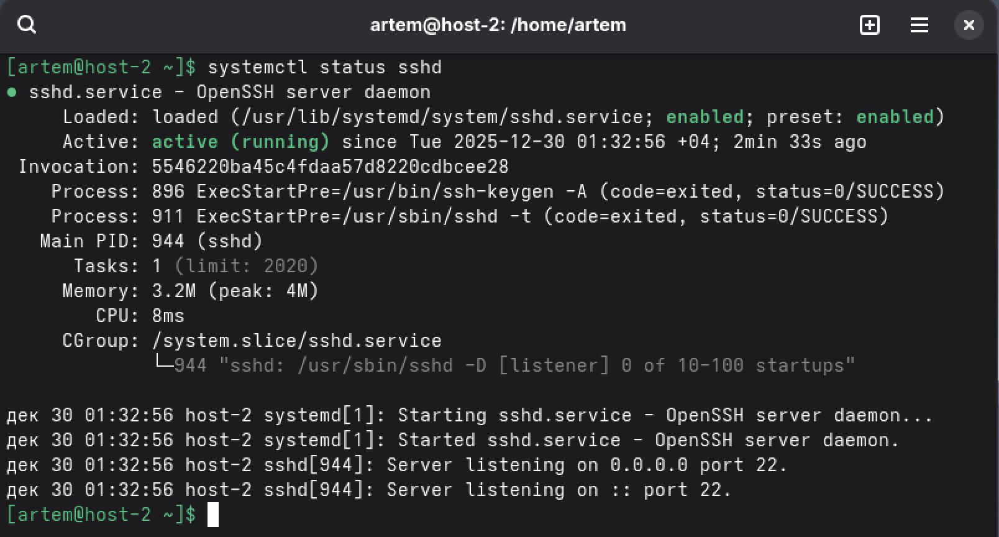
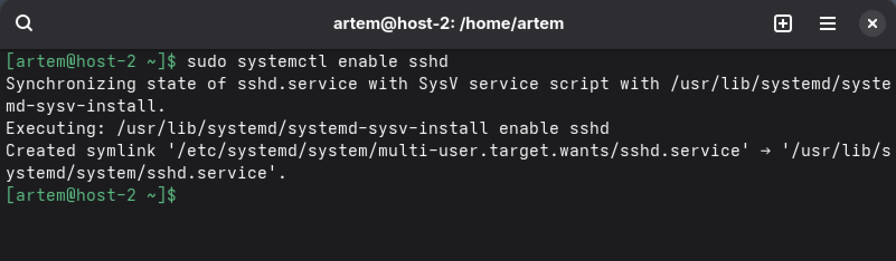
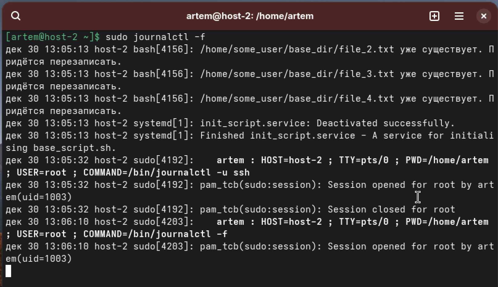
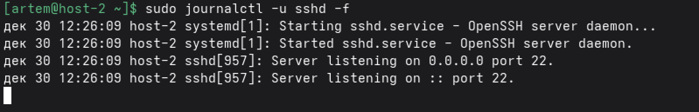

task 1 - Юниты
1. Systemd юнит — файл конфигурации для управления службами, монтированием, сокетами и т.д.

Типы: .service (сервисы), .mount (монтирование), .timer (таймеры), .target (цели).

2. Проверить статус сервиса (например, sshd):

systemctl status sshd



3. Остановить сервис:

sudo systemctl stop sshd

4. Перезапустить сервис:

sudo systemctl restart sshd

5. Убрать из автозагрузки:

sudo systemctl disable sshd

Сервис не будет запускаться при загрузке, но останется активным сейчас.

6. Вернуть в автозагрузку:

sudo systemctl enable sshd



7. Таймеры (timers) — аналог cron в systemd, планировщик задач:

systemctl list-timers          # Список таймеров

sudo systemctl start mytimer.timer  # Запустить таймер

sudo systemctl enable mytimer.timer # Включить автозапуск


task 2 - Пишем юниты
1.Скрипт:
Файл: /home/artem/my_script.sh
```
#!/bin/bash

# Переходим в домашнюю директорию (гарантированно в /home/artem)
cd "$HOME" || exit 1

# Создаем папку
mkdir -p my_data

# Создаем 4 файла
for i in 1 2 3 4; do
    FILE="my_data/file$i.txt"
    # Проверка на существование
    if [ ! -f "$FILE" ]; then
        echo "Creating $FILE"
        date > "$FILE"
        uname -r >> "$FILE"
        hostname >> "$FILE"
        echo "--- File list ---" >> "$FILE"
        ls -la ~ >> "$FILE"
    fi
done

----------

chmod +x /home/user/my_script.sh  # Делаем скрипт исполняемым
```
2.Создать systemd юнит:
Файл: /etc/systemd/system/my-service.service

```
[Unit]
Description=Artem Service
After=network.target

[Service]
Type=oneshot

User=artem
Group=artem
# Задаем рабочую папку
WorkingDirectory=/home/artem

# Путь к скрипту
ExecStart=/home/artem/my_script.sh

[Install]
WantedBy=multi-user.target


sudo systemctl daemon-reload        # Перезагружаем конфигурацию systemd
sudo systemctl start my-service     # Запускаем сервис вручную
sudo systemctl status my-service    # Проверяем статус
```
3.Создать таймер
Файл: /etc/systemd/system/my-service.timer

```
[Unit]
Description=Run my service every 5 minutes  # Описание таймера

[Timer]
OnCalendar=*:0/5  # Запускать каждые 5 минут (в 0, 5, 10, 15... минут каждого часа)

[Install]
WantedBy=timers.target  # Автозагрузка таймера


sudo systemctl daemon-reload           # Перезагружаем конфигурацию

sudo systemctl enable my-service.timer # Включаем автозапуск таймера

sudo systemctl start my-service.timer  # Запускаем таймер
```
4.Юниты по умолчанию выполняются от пользователя root (суперпользователя)

5.Создать пользователя

sudo useradd -m runner  # Создаем пользователя runner с домашней папкой

6.Дополнить юнит информацией о пользователе
Изменяем файл /etc/systemd/system/my-service.service:

```
[Service]
Type=oneshot
ExecStart=/home/user/my_script.sh
User=runner      # Запускать от пользователя runner
WorkingDirectory=~     # Рабочая директория - домашняя папка этого пользователя
```

7.Дополнить скрипт

изменим строку cd "$HOME" || exit 1 на

cd~ - ВСЕГДА работаем в домашней папке того, кто вызывает скрипт

task 3 - Журнальчики
1.Посмотреть журналы SSH

sudo journalctl -u sshd

2.Вывести журналы в реальном времени

sudo journalctl -f



3.Вывести лог в реальном времени для службы sshd

sudo journalctl -u sshd -f



4.Можно ли без команды journalctl прочитать логи systemd?
Да. Логи systemd хранятся в:

/var/log/syslog (общие системные логи)

/var/log/auth.log (логи аутентификации, включая SSH)

/var/log/kern.log (логи ядра)

5.Сколько будет 2-2?

≽^•⩊•^≼
