task1 - Настриваем

1.По умолчанию используется порт 22

2.Да. В файле /etc/ssh/sshd_config:

Port 2222  # Изменить 22 на нужный порт

После изменения:

sudo systemctl restart sshd

3.Служба sshd (OpenSSH Daemon)

4./etc/ssh/sshd_config

5.Подключение к серверу

ssh username@server_ip

или с указанием порта

ssh -p 2222 username@server_ip

подключимся к нашему серверу:

ssh -p 219 student@ternar.io

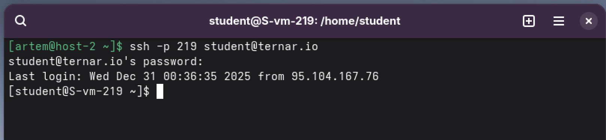

6. Разрешить root-подключение

В файле /etc/ssh/sshd_config:

PermitRootLogin yes  # Было: PermitRootLogin prohibit-password

sudo systemctl restart sshd

7.Изменить количество попыток ввода пароля

В файле /etc/ssh/sshd_config:

MaxAuthTries 2  # Было: MaxAuthTries 6

Изменения:

sudo systemctl restart sshd

sudo grep MaxAuthTries /etc/ssh/sshd_config

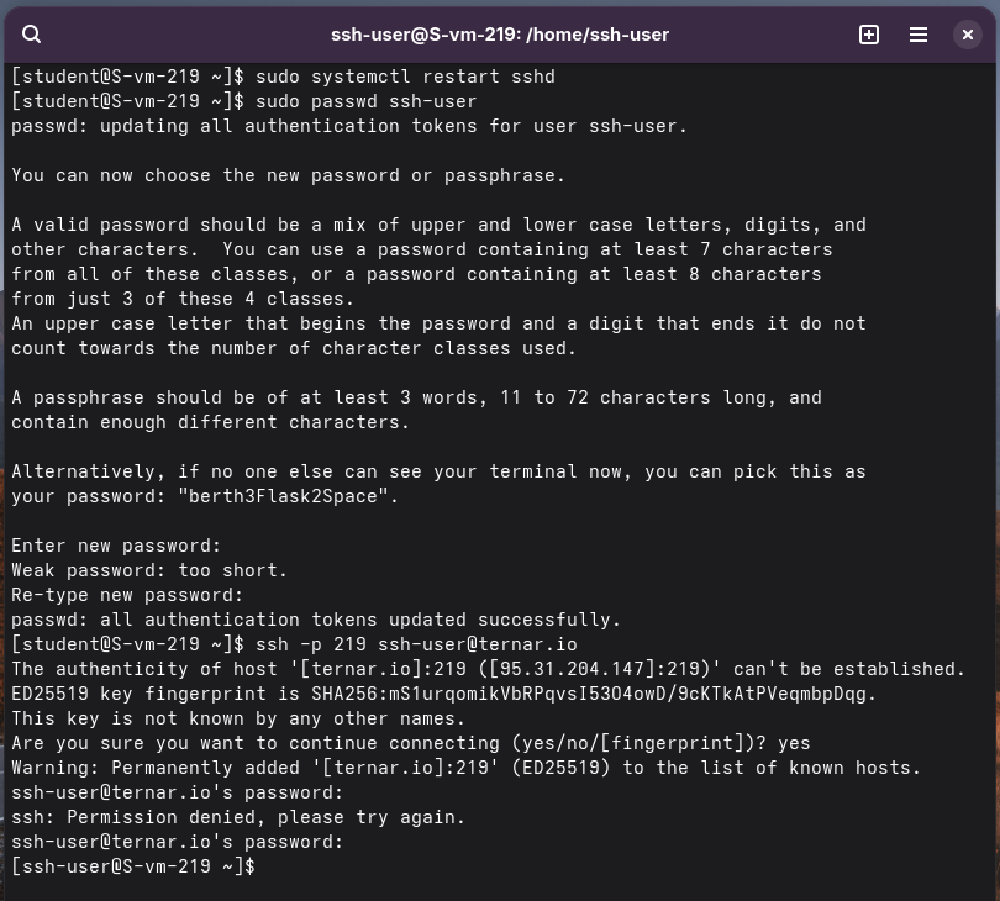

ssh -p 219 student@ternar.io

8.Создать пользователя ssh-user

sudo systemctl restart sshd

sudo passwd ssh-user

ssh -p 219 ssh-user@ternar.io

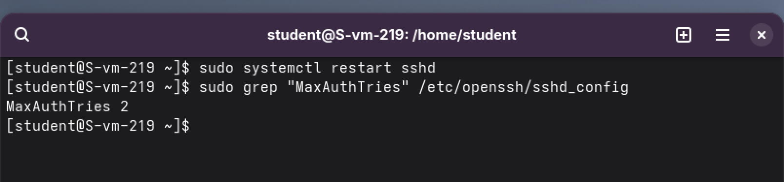

9.Ограничить доступ ssh-user

В файле /etc/ssh/sshd_config добавить:

DenyUsers ssh-user  # Запретить пользователя

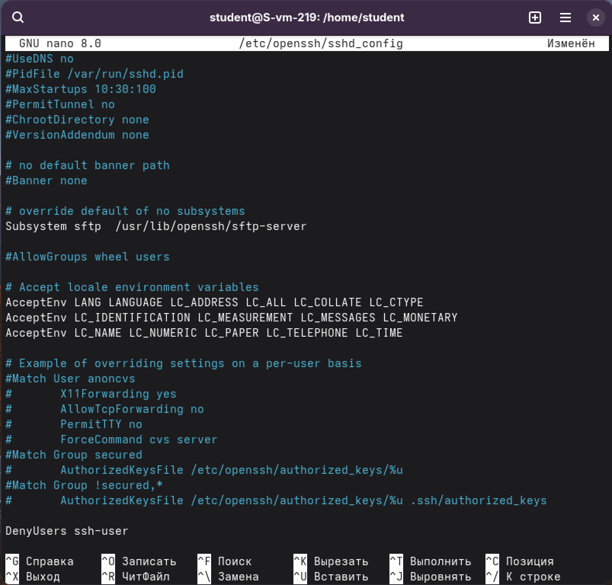

итог:

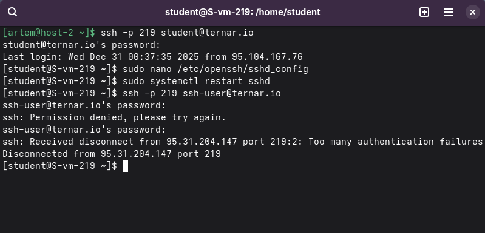

sudo systemctl restart sshd

10. как в 9ом

11.Файл known_hosts
Файл ~/.ssh/known_hosts хранит:

-Отпечатки ключей хостов (fingerprints) серверов

-Для проверки подлинности сервера при следующем подключении

-Защита от атак "man-in-the-middle"

Посмотреть содержимое:

cat ~/.ssh/known_hosts

task2 - Конфижим для удобства
1.Пользовательские: ~/.ssh/config

Системные: /etc/ssh/ssh_config

2.~/.ssh/config

3.Отредактировать файл config для упрощения подключения:

nano ~/.ssh/config

Добавить:

Host myserver  # Удобное имя

HostName ternar.io  # IP или домен сервера
    
User student       # Имя пользователя по умолчанию
    
Port 219            # Порт

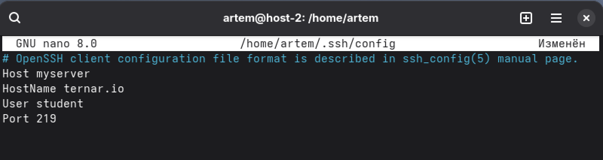

4.myserver

5.еперь можно подключаться просто по имени:

ssh myserver

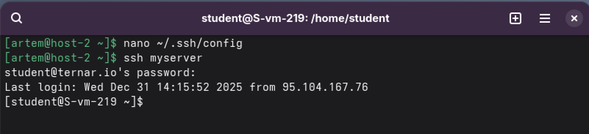

Проверка конфига на ошибки:

ssh -G myserver

Отладка подключения:

ssh -v myserver

task3 - Ключики

1.SSH ключи — это пара криптографических ключей (публичный и приватный) для аутентификации без пароля. Нужны для:

-Безопасности (сильнее паролей)

-Автоматизации (скрипты, CI/CD)

-Удобства (не вводить пароль каждый раз)

2.ssh-keygen -t ed25519

Или RSA:

ssh-keygen -t rsa -b 4096

3.ssh-keygen -t ed25519 -f ~/.ssh/id_ed25519_key

хранятся:

Приватный: ~/.ssh/id_ed25519_key

Публичный: ~/.ssh/id_ed25519_key.pub

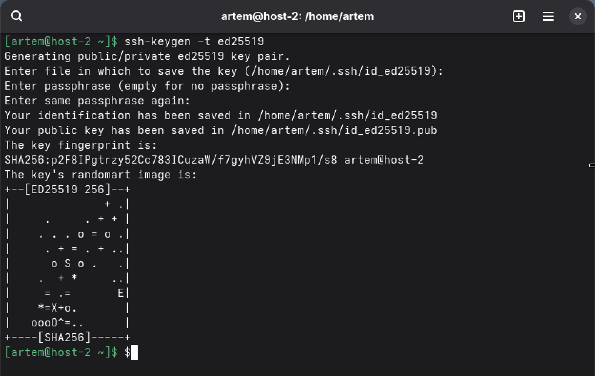

4.ssh-copy-id -i ~/.ssh/id_ed25519_key.pub my_server

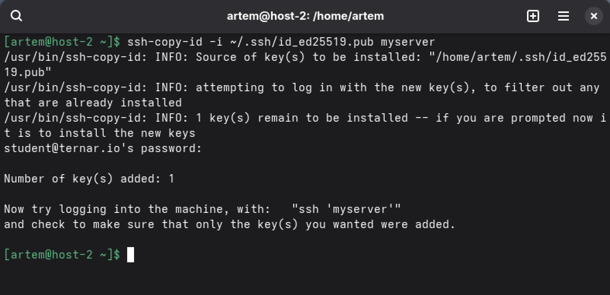

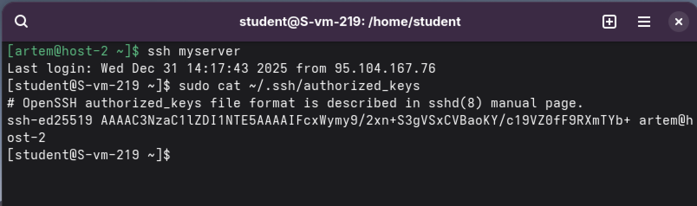

Ключ хранится на сервере в: ~/.ssh/authorized_keys

5.
Пароль не запрашивается

6. Запретить подключение с паролем

На сервере в /etc/ssh/sshd_config:

PasswordAuthentication no

ChallengeResponseAuthentication no

UsePAM no

Перезапустить:

sudo systemctl restart sshd

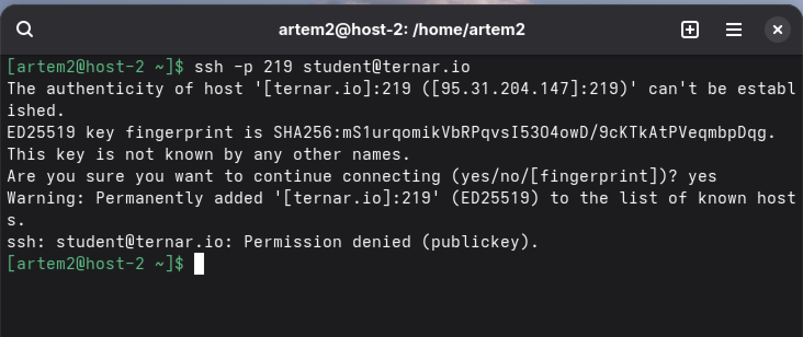

Мы создали нового пользователя artem2, как только мы под него залогинились - ничего не вышло
