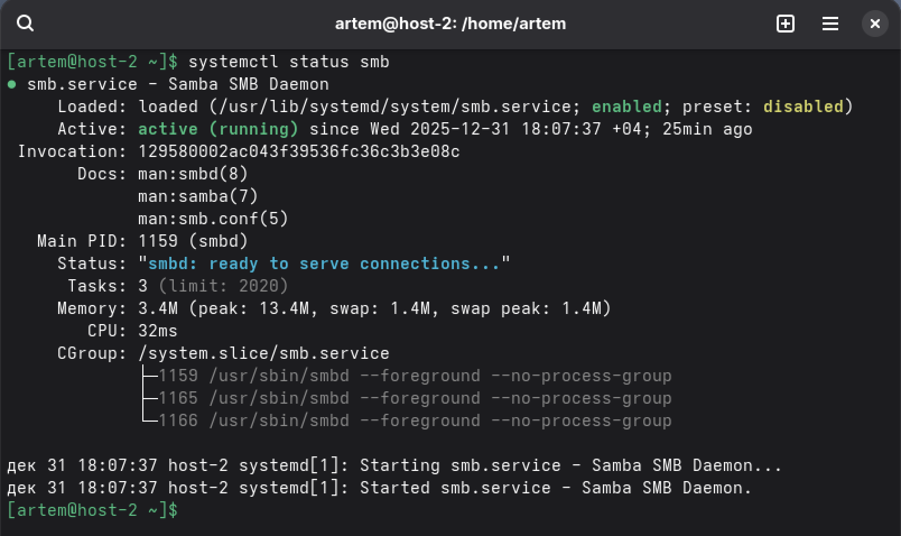
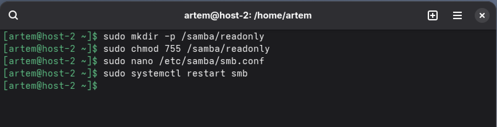
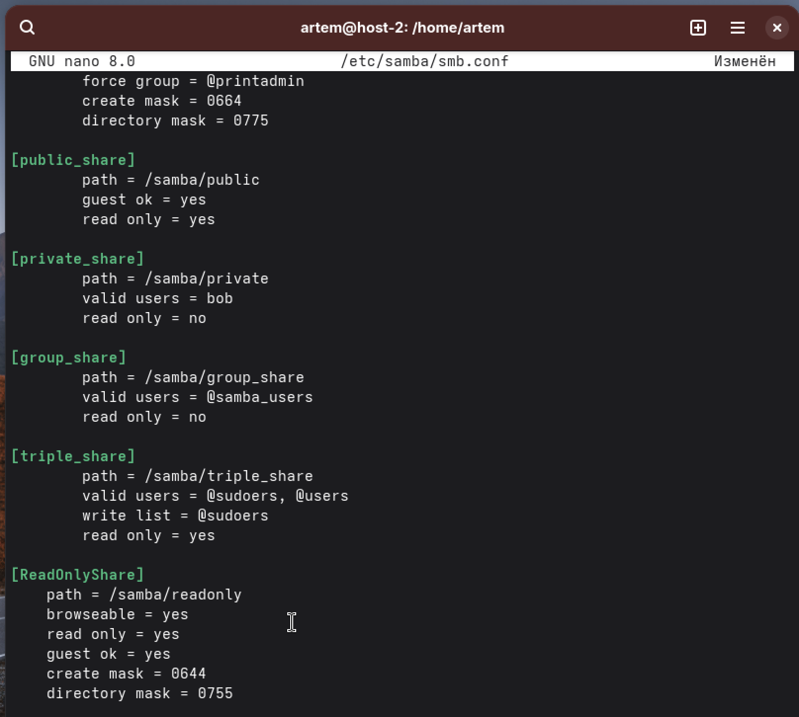
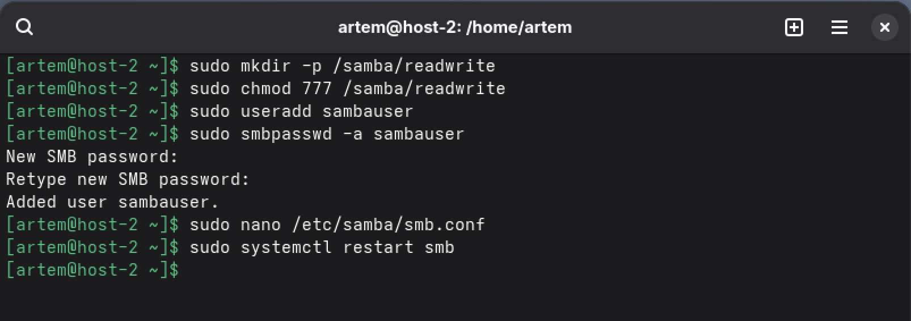
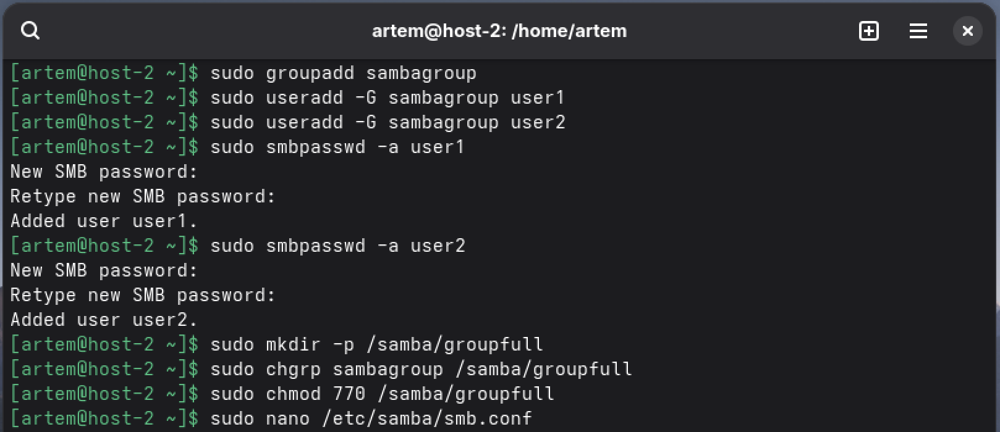
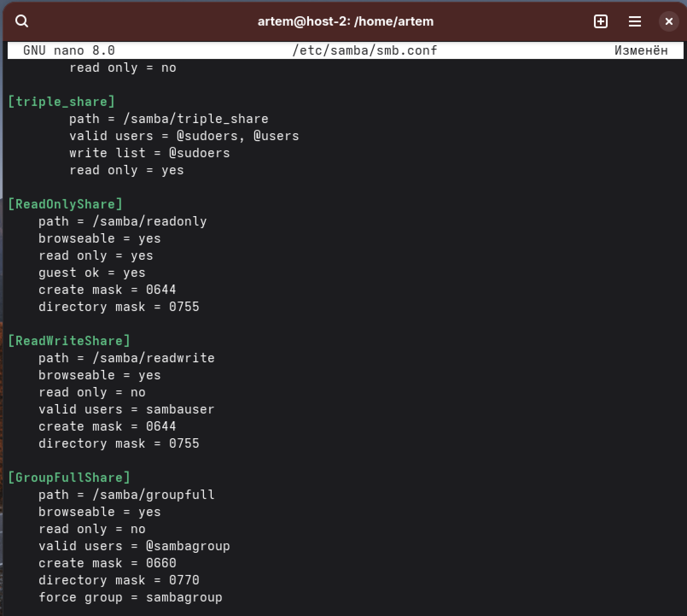
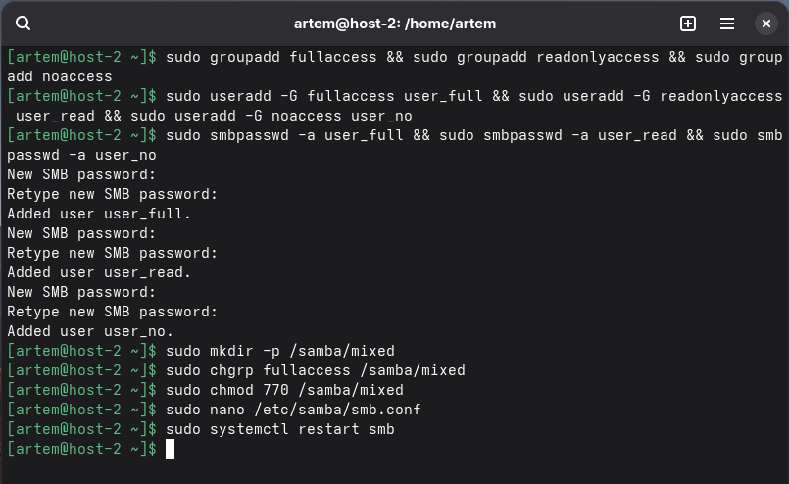
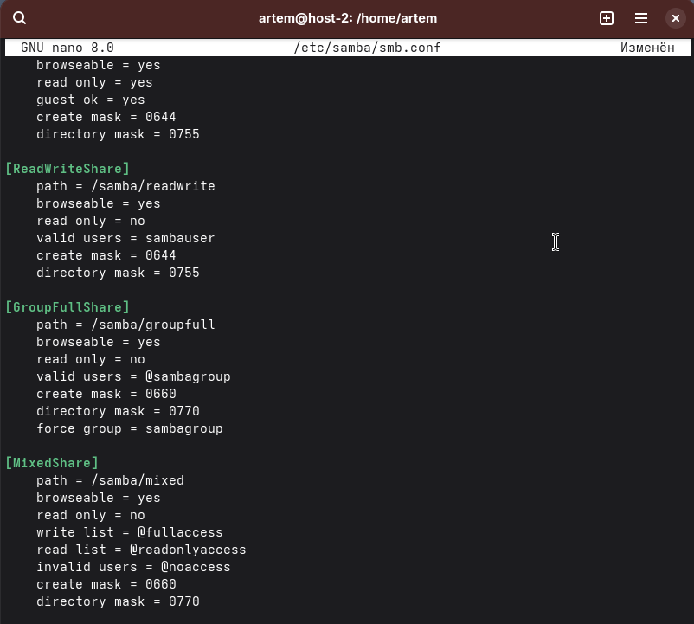

task - Шарим

1.sudo apt update

sudo apt-get install samba -y

sudo systemctl status smb



2.Общая папка (шара) — это директория в сети, доступная нескольким пользователям/компьютерам. Нужна для:

-Совместной работы с файлами

-Обмена данными между разными ОС (Windows/Linux/Mac)

-Централизованного хранения файлов

-Резервного копирования

3.
Создадим директорию, и выдадим на неё права



Уже после настроим Samba

```
# Настроить Samba (/etc/samba/smb.conf)
[ReadOnlyShare]
    path = /samba/readonly
    browseable = yes
    read only = yes
    guest ok = yes
    create mask = 0644
    directory mask = 0755
```



4. 

такой же метод как и в 3

```
sudo mkdir -p /samba/readwrite
sudo chmod 777 /samba/readwrite

# Добавить пользователя Samba
sudo useradd sambauser
sudo smbpasswd -a sambauser

[ReadWriteShare]
    path = /samba/readwrite
    browseable = yes
    read only = no #и чтение и запись
    valid users = sambauser 
    create mask = 0644
    directory mask = 0755

sudo systemctl restart smb
```



5.
```
sudo groupadd sambagroup
sudo useradd -G sambagroup user1
sudo useradd -G sambagroup user2
sudo smbpasswd -a user1
sudo smbpasswd -a user2

sudo mkdir -p /samba/groupfull
sudo chgrp sambagroup /samba/groupfull
sudo chmod 770 /samba/groupfull

[GroupFullShare]
    path = /samba/groupfull
    browseable = yes
    read only = no
    valid users = @sambagroup
    create mask = 0660
    directory mask = 0770
    force group = sambagroup

sudo systemctl restart smb
```





6.
```
# группы
sudo groupadd fullaccess
sudo groupadd readonlyaccess
sudo groupadd noaccess

# пользователи
sudo useradd -G fullaccess user_full
sudo useradd -G readonlyaccess user_read
sudo useradd -G noaccess user_no

sudo smbpasswd -a user_full
sudo smbpasswd -a user_read
sudo smbpasswd -a user_no

sudo mkdir -p /samba/mixed
sudo chgrp fullaccess /samba/mixed
sudo chmod 770 /samba/mixed

[MixedShare]
    path = /samba/mixed
    browseable = yes
    read only = no
    write list = @fullaccess
    read list = @readonlyaccess
    invalid users = @noaccess
    create mask = 0660
    directory mask = 0770

sudo systemctl restart smb
```



использовал между командами &&. поэтапность описана выше


