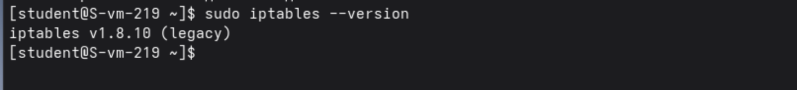
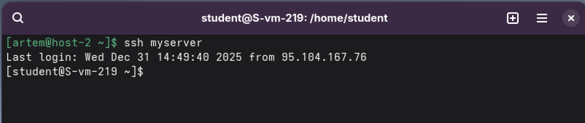
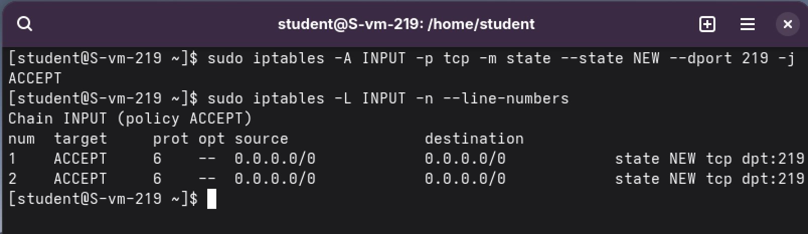
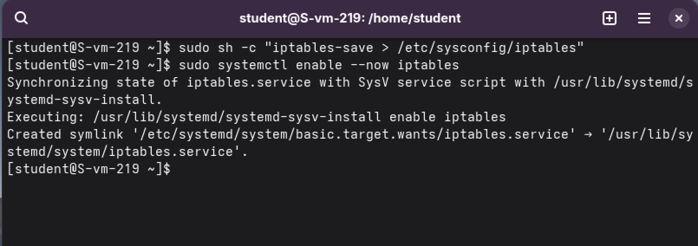
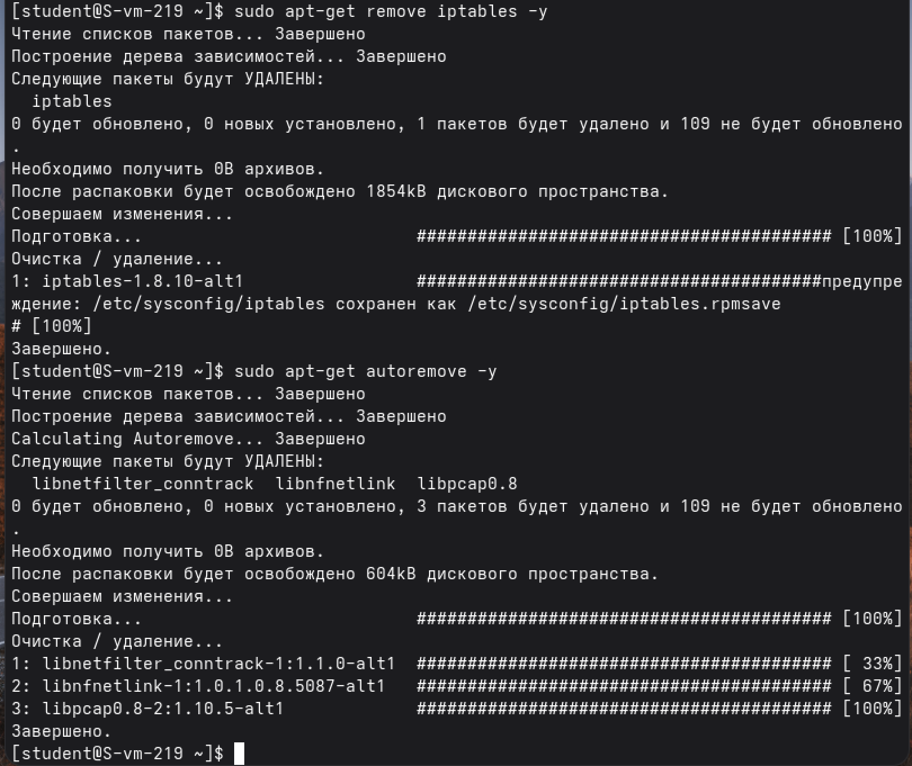
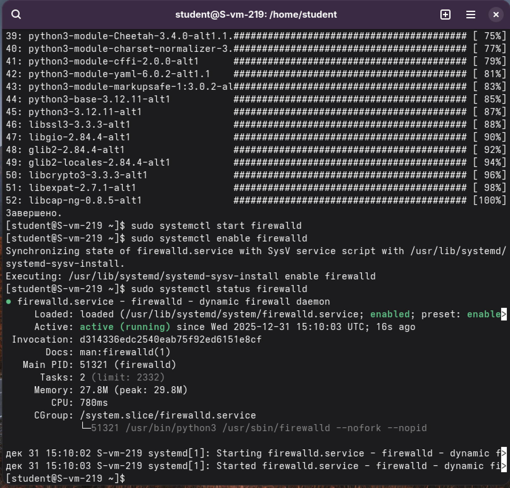
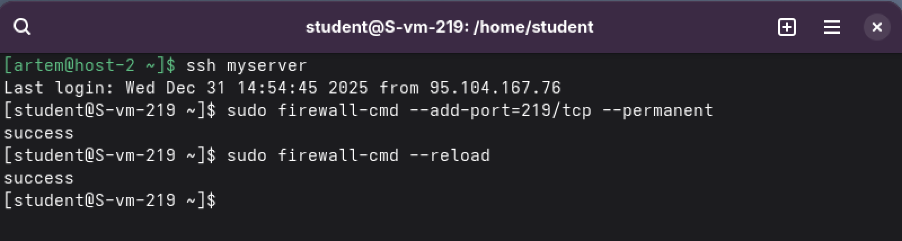
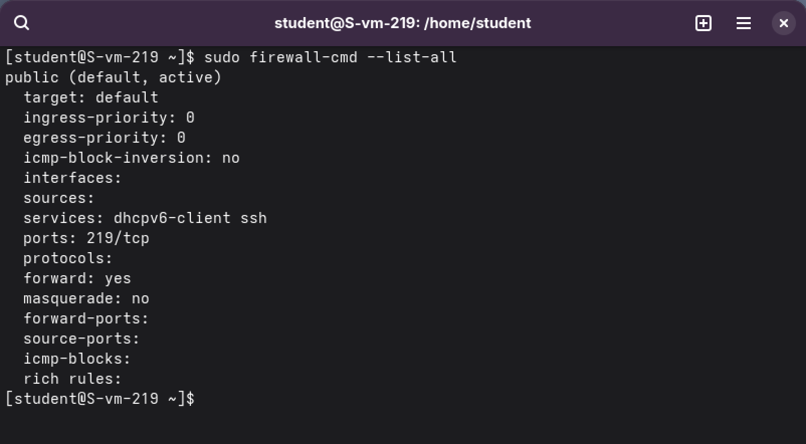

task1 - iptables

1.sudo apt update

sudo apt-get install iptables -y

sudo iptables --version

2.С другой консоли:
ssh my_server

3.При установке iptables начинает работать со стандартными правилами:

-По умолчанию может быть политика DROP или REJECT на все входящие

-Если не настроены явно правила для SSH (порт 22/TCP), подключение блокируется

4.Разрешаем SSH на входящие подключения с привязкой к состоянию (безопасно)

sudo iptables -A INPUT -p tcp -m state --state NEW --dport 219 -j ACCEPT

sudo iptables -L INPUT -n --line-numbers

случайно применил команду sudo iptables -A INPUT -p tcp -m state --state NEW --dport 219 -j ACCEPT дважды, из-за этого в таблице 2 строки

5.SSH использует TCP порт 219

6.Нет, правила iptables сбрасываются при перезагрузке

7.

sudo sh -c "iptables-save > /etc/sysconfig/iptables"

sudo systemctl enable --now iptables

task2 - firewald
1.Удаляем iptables

sudo apt-get remove iptables -y

sudo apt-get install firewalld -y

sudo systemctl start firewalld
sudo systemctl enable firewalld
sudo systemctl status firewalld

2.

ssh myserver

3.

sudo firewall-cmd --add-port=22/tcp --permanent

sudo firewall-cmd --reload

4.
Подробная информация
sudo firewall-cmd --list-all

5.Да, Firewalld знает стандартные сервисы:

Посмотреть все доступные сервисы
sudo firewall-cmd --get-services

Добавить по имени сервиса
sudo firewall-cmd --add-service=http --permanent
sudo firewall-cmd --add-service=https --permanent
sudo firewall-cmd --add-service=samba --permanent

sudo firewall-cmd --reload

6.smbclient //host-2/MixedShare -U user_full%password

7.sudo firewall-cmd --add-service=samba --permanent

sudo firewall-cmd --reload

8.Все команды с ключом --permanent уже постоянные

После изменений обязательно:
sudo firewall-cmd --reload

Проверить постоянные правила
sudo firewall-cmd --list-all --permanent

Сохранить текущие правила в файл
sudo firewall-cmd --runtime-to-permanent
