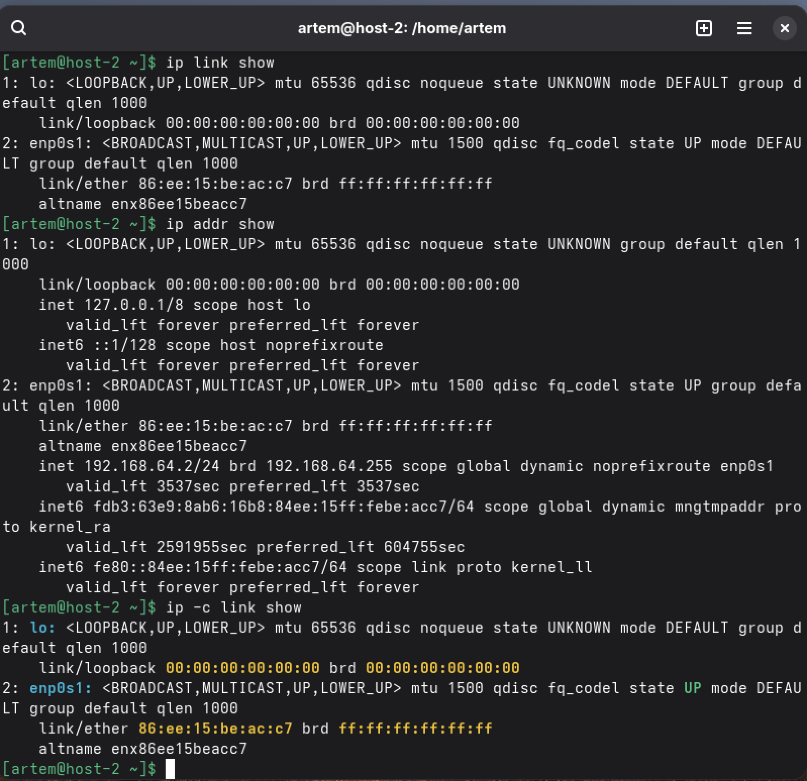
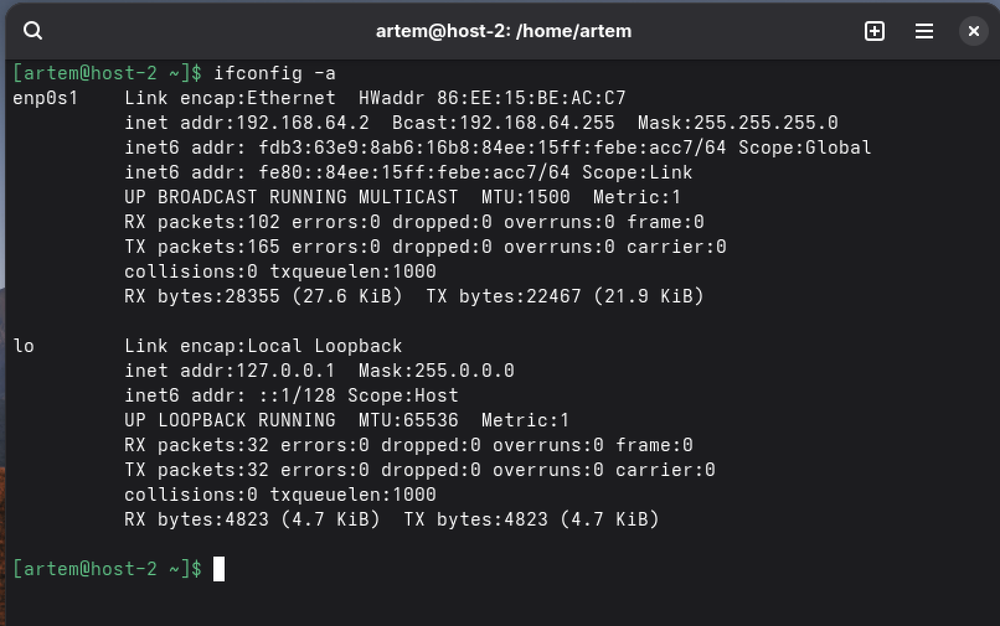
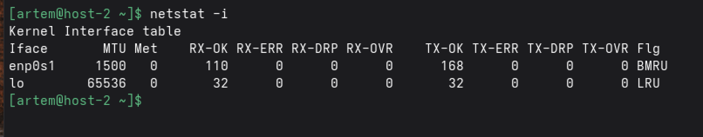
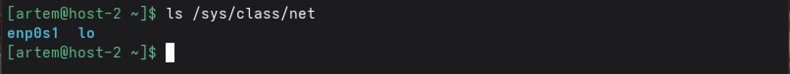
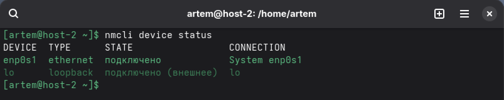
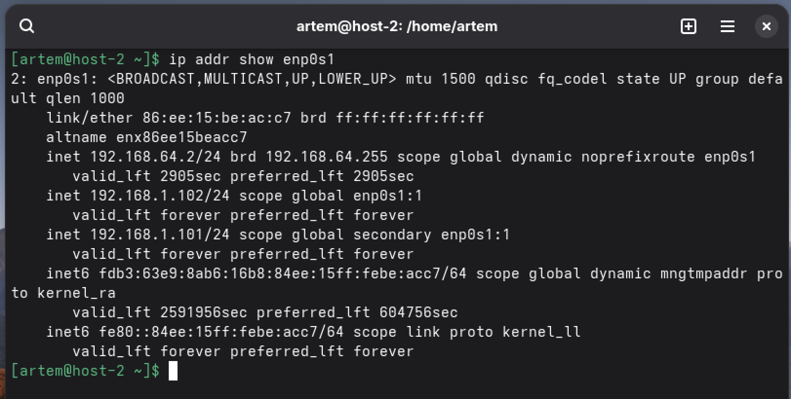
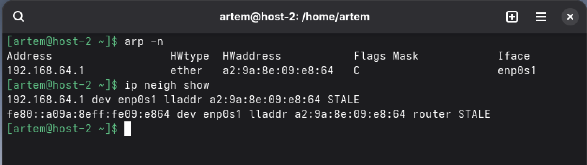

task - сети
1. Способы:

-ip-

ip link show

ip addr show

ip -c link show  # с цветом

-ifconfig-

ifconfig -a

sudo apt install net-tools  # если нет ifconfig

-netstat-

netstat -i

-ls /sys/class/net-

ls /sys/class/net

-nmcli-

nmcli device status

2.Временное изменение (до перезагрузки)

sudo ip addr add 192.168.1.100/24 dev eth0
sudo ip addr del 192.168.1.50/24 dev eth0  # удалить старый

Или через ifconfig

sudo ifconfig eth0 192.168.1.100 netmask 255.255.255.0

3.Добавить дополнительный IP

sudo ip addr add 192.168.1.101/24 dev eth0 label eth0:1

sudo ip addr add 192.168.1.102/24 dev eth0 label eth0:2

ip addr show eth0

4.
ip addr show enp0s1

5.
arp -a

ip neigh show

6.IP адрес - уникальный числовой идентификатор устройства в сети (например: 192.168.1.1)

7.Маршруты указывают, куда отправлять пакеты для достижения других сетей (таблица маршрутизации)

8.ARP (Address Resolution Protocol) - протокол для определения MAC-адреса по IP-адресу в локальной сети

9.DHCP (Dynamic Host Configuration Protocol) - автоматическая выдача IP-адресов и сетевых настроек устройствам

10.DNS (Domain Name System) (не магазин) - система преобразования доменных имен в IP-адреса (например: google.com → 172.217.16.206)

11.NTP (Network Time Protocol) - для синхронизации времени по сети

12.Запрос, отправляемый на все устройства в сети. Нужен для:

-Поиска серверов (DHCP Discover)
-Обнаружения сетевых служб
-Определения MAC-адресов (ARP Request)

13.Для сети 192.168.1.0/24: 192.168.1.255
Общий: 255.255.255.255

14.
MAC-адрес
sudo ip link set eth0 address 00:11:22:33:44:55

MTU (Maximum Transmission Unit)
sudo ip link set eth0 mtu 9000

Включить/выключить
sudo ip link set eth0 up
sudo ip link set eth0 down

Скорость и дуплекс
sudo ethtool eth0

15.Маска подсети (например: 255.255.255.0 или /24) определяет:

-Какая часть IP адреса относится к сети
-Какая часть отосится к устройству
-Размер подсети (сколько может быть устройств)
